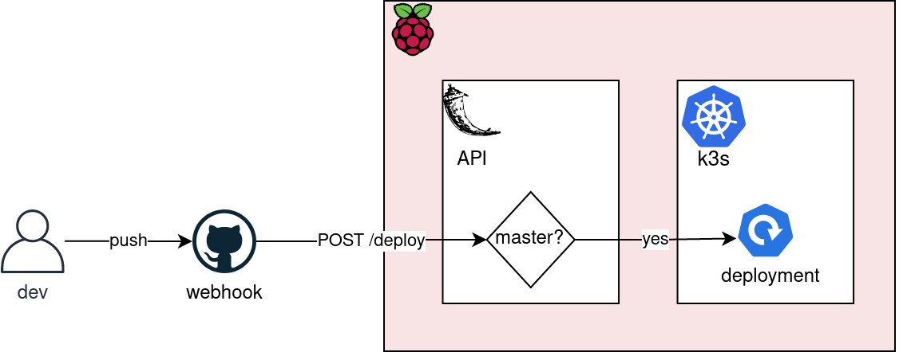

# Deployment Webhook
This simple Sinatra (ruby) API listens for POST requests on the `/deploy` path.

The POST requests are triggered by the `Continuous Delivery` workflow on the `back-end` repo, which updates the deployment in k3s. 

<p align="center">

</p>

It's implemented as a `systemd` service. So see below if you need to make changes.

## Installing the service

To use this API as a service, you need to copy the [`webhook.service`](webhook.service) file to `/etc/systemd/system/` and start it with `sudo systemctl start webhook.service`

## Updating service

In case you need to modify the code you have to execute these commands:

1. Open the source code:
   ```bash
   vi /usr/bin/webhook
   ```
2. Make your modifications and save them by executing `:wq`.
3. Restart the service:
   ```bash
   sudo systemctl restart webhook.service
   ```

## Viewing service logs

To se the logs all you have to do is execute this command:

```bash
journalctl -fu webhook.service
```