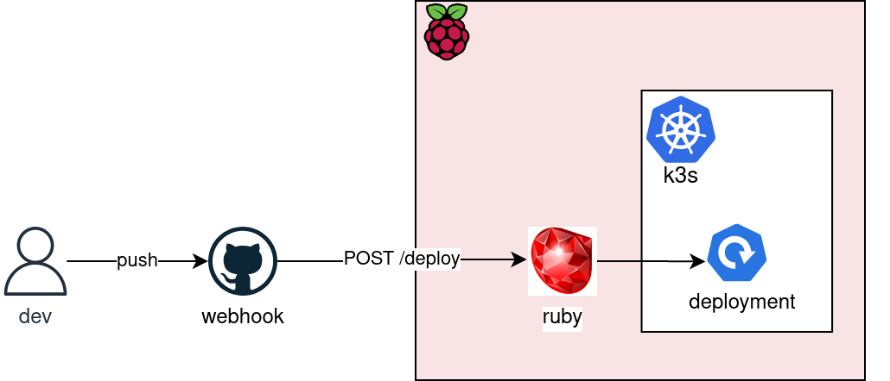

# Deployment Webhook
This simple Flask API listens for POST requests on the `/deploy` path.

The POST requests are triggered by every push on the `back-end` repo. If the `push` is on the `main` branch, it triggers the deployment upgrade on the cluster. 

